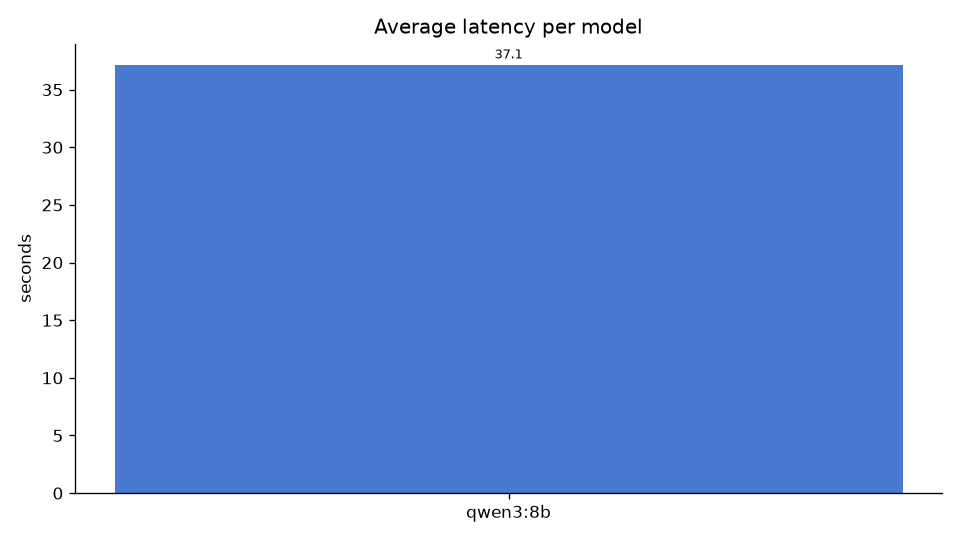
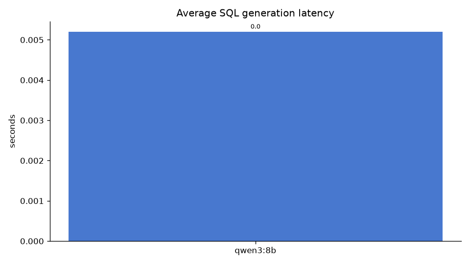
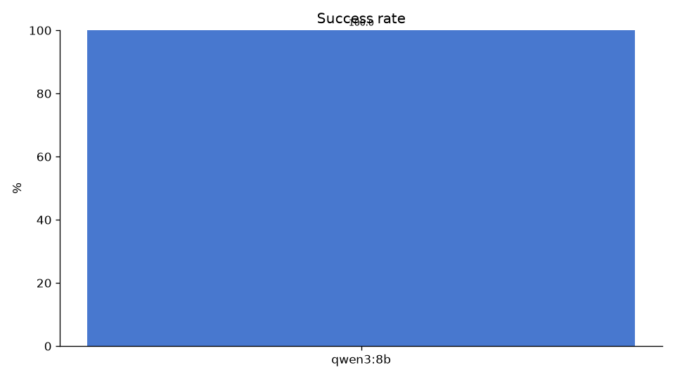
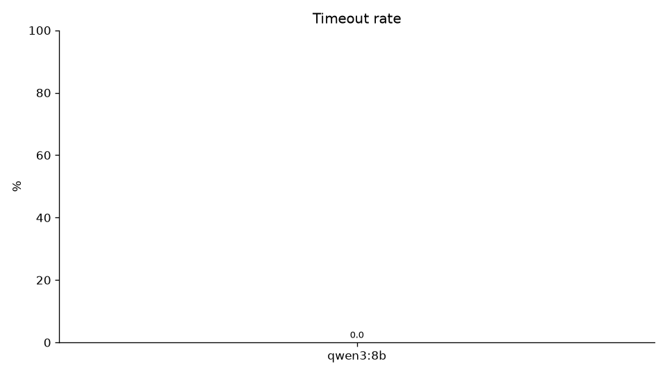
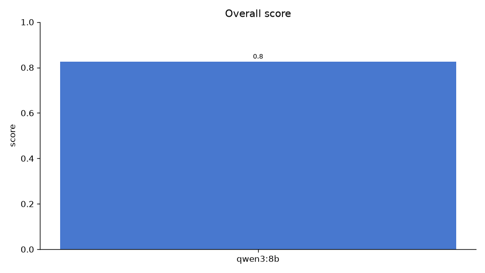
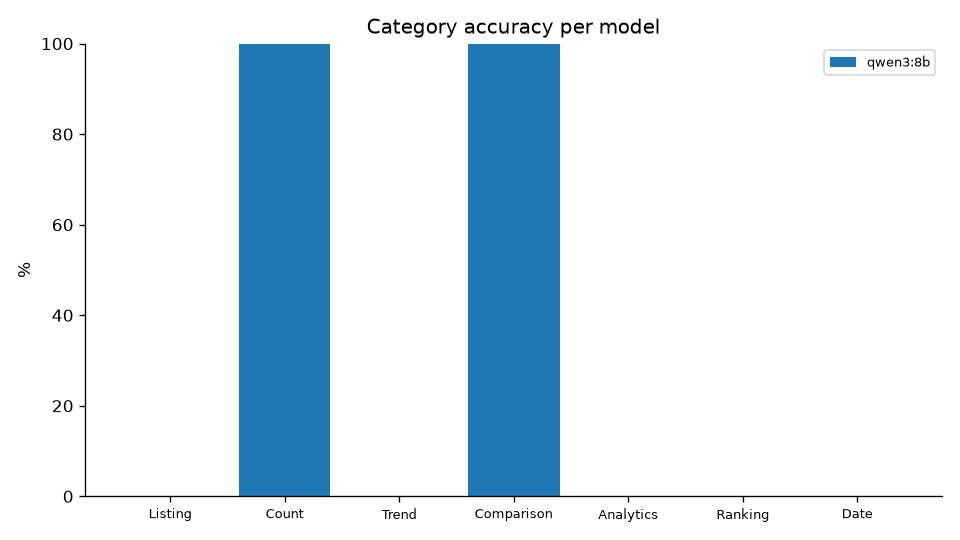
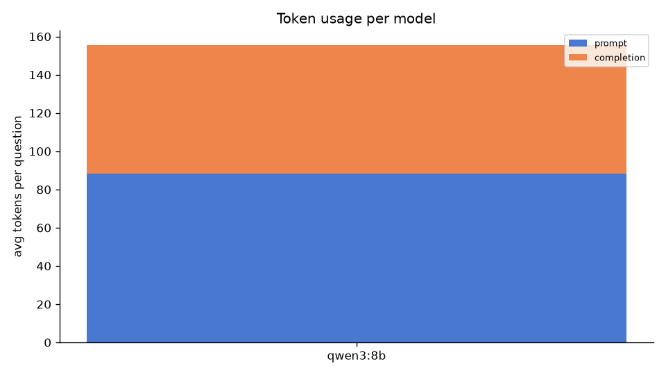
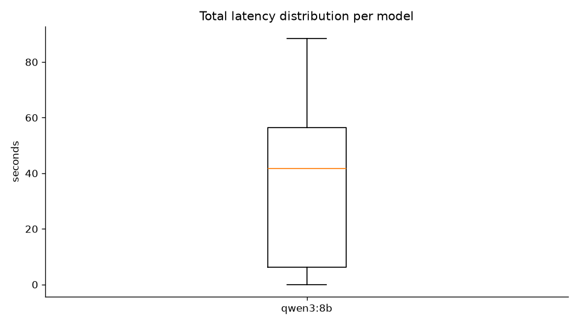

# Benchmark Summary Report

Generated: 2026-07-24 07:10 UTC  
Total duration: 1872s  

## Overall Ranking

| Rank | Model | Success Rate | Avg Time | P95 | Avg SQL Time | Timeout | Retries | Overall Score |
|------|-------|-------------:|---------:|----:|-------------:|--------:|--------:|--------------:|
| 1 | qwen3:8b | 91.1% | 14.5 s | 48.6 s | 2 ms | 0.0% | 0.0% | 0.885 |
| 2 | qwen3:4b | 87.5% | 18.8 s | 60.7 s | 2 ms | 0.0% | 0.0% | 0.837 |

## Performance Breakdown

| Model | Avg Workflow | SQL Gen | Analytics | Insight | Report | Total LLM Time |
|-------|-------------:|--------:|----------:|--------:|-------:|---------------:|
| qwen3:8b | 14.5 s | 2 ms | 892.4 ms | 2.5 s | 1.2 s | 3.7 s |
| qwen3:4b | 18.8 s | 2 ms | 1322.4 ms | 3.5 s | 904 ms | 4.4 s |

## Accuracy Breakdown

| Model | Listing | Count | Trend | Comparison | Analytics | Ranking | Date | Overall |
|-------|----:|----:|----:|----:|----:|----:|----:|----:|
| qwen3:8b | 83.3% | 66.7% | 100.0% | 80.0% | 100.0% | 100.0% | 83.3% | 91.1% |
| qwen3:4b | 66.7% | 66.7% | 100.0% | 60.0% | 100.0% | 100.0% | 83.3% | 87.5% |

## Failure Analysis

| Model | Timeout | Invalid SQL | Wrong Entity | Wrong Join | Pipeline Error | Empty Result | SQL Gen Failed | Unneeded Clarification |
|-------|----:|----:|----:|----:|----:|----:|----:|----:|
| qwen3:8b | 0 | 0 | 0 | 0 | 0 | 2 | 3 | 0 |
| qwen3:4b | 1 | 1 | 0 | 0 | 0 | 2 | 3 | 0 |

## Resource Usage

| Model | Avg Prompt Tokens | Avg Completion Tokens | Avg Total Tokens |
|-------|------------------:|----------------------:|-----------------:|
| qwen3:8b | 17 | 13 | 30 |
| qwen3:4b | 8 | 43 | 51 |

## Recommendation

**Fastest Model:** qwen3:8b (14.5 s avg)

**Most Accurate Model:** qwen3:8b (91.1% success)

**Best Overall Model:** qwen3:8b (score 0.885)

**Recommended Production Model:** qwen3:8b

**Reason:** 'qwen3:8b' has the highest overall score (0.885) combining a 91.1% success rate with an average total latency of 14.5 s (P95 48.6 s, timeout rate 0.0%).

## Charts

